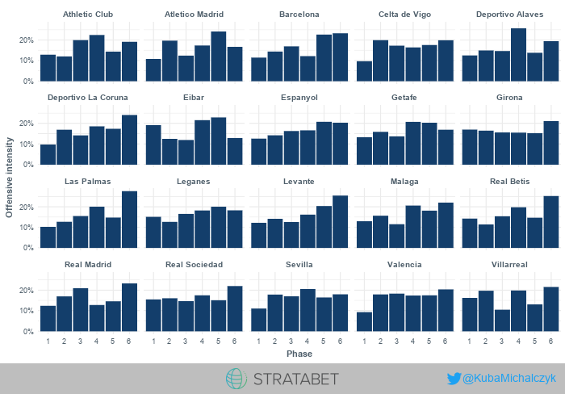
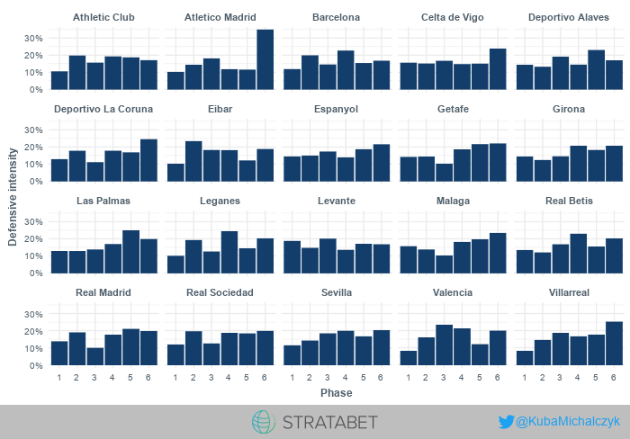
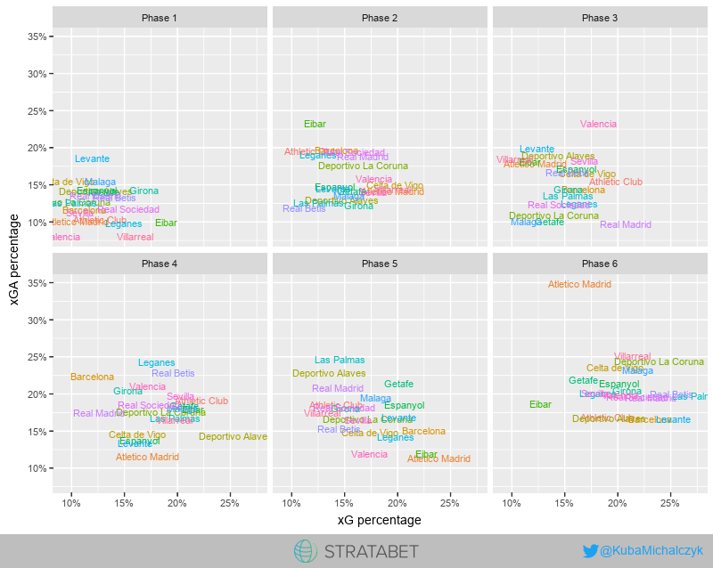
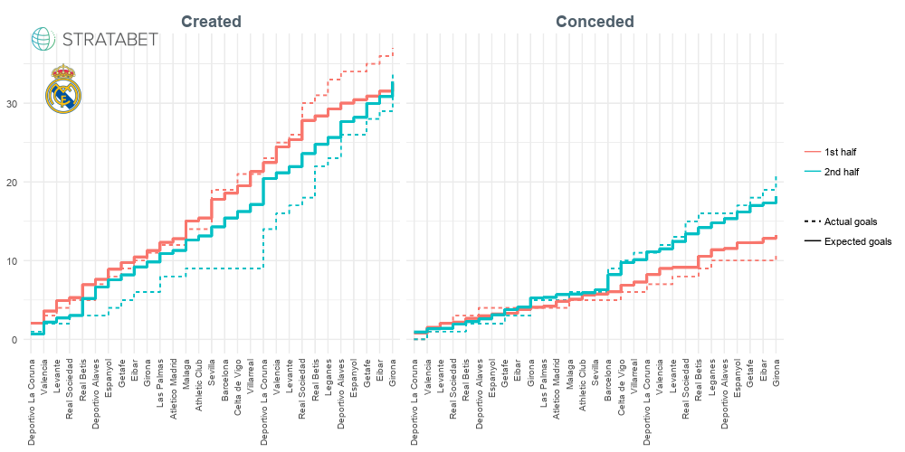
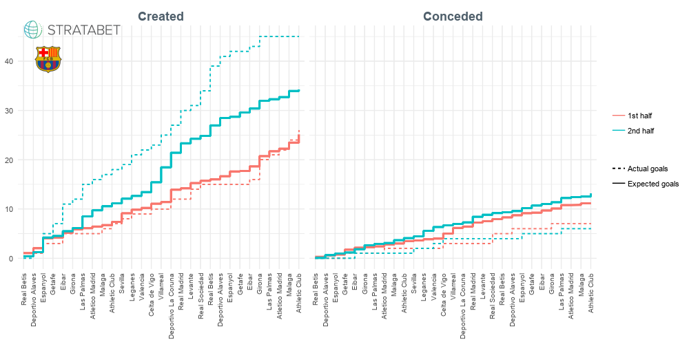

A glimpse on game phases
================
Twitter: @KubaMichalczyk

Background: Every team has its bad and good moments during a game. A football match is too long to keep a high tempo during whole 90 minutes. Sometimes teams clearly intends to freeze some part of a game, awaits and attack later as it is a part of a bigger plan. This is more often observed in cup clashes, but happens in league games too. Therefore, the objective of this analysis was to check if the scheme repeats in case of any teams. This may be potentially valuable information to coaches who are planning to play this kind of a chess.

The data used in the following analysis contained this season Spanish La Liga matches played before 2018/03/18.

To perform this analysis, I divided a match into six phases so that each quarter defines another phase. One of the limitations is that I didn't have an information if a chance took place in the first or second half, but only a time of event. This is a little problematic as the chances created in minutes 46th or 47th could actually happen in first half injury time. Actually, the dataset contained 178 such a cases (I have considered only 1 and 2 minutes added as more than that is added extremely rare to the first half). Therefore, any scores for 3rd and 4th quarter (1st of the second half) will be biased and we should keep this in mind while analysing output. Final phase (6th) included additional time, therefore scores have been standarised to 15 minutes (multiplied by the ratio of 15 minutes and the true length of phase 6). Here I have faced another limitation - as I didn't have exact match duration I have assumed that the final whistle time is the maximum of final time recorded and 90 minutes. In 111 out of 290 games I ended up with the length of 90 minutes. I hoped to get a smaller proportion here, but don't see any reasonable alternative. I believe it is still far better solution than ignoring additional time at all. A few of these 111 games could actually end up in regular time.

As a summary statistic I have used the proportion of expected goals created/conceded in each phase. The motivation for that is the fact that we clearly don't expect from Deportive Alaves to score the same number of goals as Barcelona and still would like to easily compare their performance. For the purpose of this text I will refer to this proportions as attacking/defensive intensity.

To calculate expected goals I used my model which I had published here. This model doesn't predict for penalties and own goals. However, it would be a huge loss of information if we would exclude these chances from our analysis. Therefore, I just decided to make use of @Stratabet chance rating and assign the conversion rate (as stated in their documentation) according to the level of this variable in case of chances that ended up in own goals. Regarding penalties I calculated conversion rate myself using the same dataset as in my Expected Goals model and obtained the score of 74.69%.

|  Poor|  Fairly good|  Good|  Very good|  Great|  Superb|  Penalty|
|-----:|------------:|-----:|----------:|------:|-------:|--------:|
|  0.03|         0.05|  0.08|       0.22|   0.43|    0.83|   0.7469|

So let's start with attacking intensity.

Barcelona seems deadly during final 30 minutes. Real Madrid is warning up with time in each half. Deportivo Alaves is a curious one with high intensity after a break, doubling almost all other phases (but let's not forget this high bar may actually contain some chances from a first half injury time). Eibar tends to start each half with high intensity but cools down later (although this effect last longer in second halves). This may indicate that these intensive starts are probably physically demanding for them. They are also teams like Girona or Real Sociedad that looks rather steady in their creation. Surprisingly, the team which creates the highest proportion of their expected goals in phase 6 is Las Palmas.

What stands out here is the high proportion of conceded goals by Atletico Madrid in the final phase. The reason for that is probably lack of ratation caused by the plague of injuries (Diego Simeone has only 12 fit players at the moment!). Villareal has a clear increasing tendency with time and ends up among the teams who concedes the most of their xGA in the 6th phase.

The locations and compactness of the plot of Phase 1 isn't surprising as opposed to the fact that the team who dominates their rivals the most during first minutes is Eibar. Villarreal also has decent starts with 16% of their xG and 8% of xGA. On the other side is Valencia which has a great season under Marcelino, but clearly freezes the first minutes of games with both xG and xGA below 10%. Intensive starts from Eibar seem to cool down in second phase, which they tend to loose clarly in terms of expected goals. After calm start Valencia tend to exchange blows in the Phase 3. Also worth to notice are Real Madrid's decent 3rd phases. When analysing second halfs (phases 4th, 5th and 6th) three teams are conspicuous: Atletico Madrid, Deportivo Alaves and again - Eibar. The latter (alongside Atletico) have a greatest 5th phase among all teams, but seem to defend the results in final minutes. Both Real Madrid and Barcelona start the second half poorly, maybe due to the lack of concentration?

Finally, while we're talking about two giants - it was said for quite a time this season about their second halfs - poor in case of Madrid and deadly in case of Barcelona. So let's combine phases 4, 5 and 6 and check out how it looks like in terms of expected goals.

Indeed, Real Madrid tend to perform worse in second halfs, both in creation and defence. However, expected goals indicate that the real difference may be in fact a way smaller. Particularly, when they were struggling to score a goal in second half for a five games in a row, the actual expected goals trend didn't differ from the one from the rest of a season.

On the other side we've got Barcelona, who just break the xG model in second halfs. The other thing that stands out is how they overperform the model in defensive context. Well, the credit should go to Marc-Andre ter Stegen who has been brilliant this season.

**This article was written with the aid of StrataData, which is property of [Stratagem Technologies](www.stratagem.co). StrataData powers the [StrataBet Sports Trading Platform](https://app.stratabet.com), in addition to [StrataBet Premium Recommendations](https://stratatips.co).**
